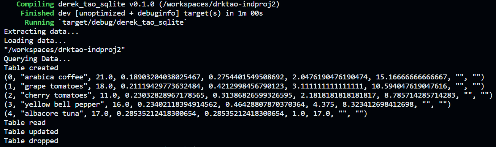
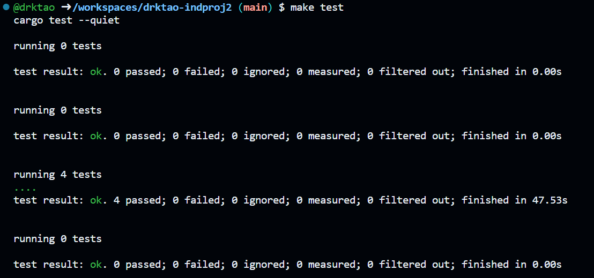

## Individual Project 2
In this project, I performed CRUD operations on an SQLite database using Rust. Specifically, the project contains the following important files:
1. `cicd.yml` - a workflow file that builds, formats, lints, and tests the Rust code. It also generates an optimized Rust binary as a GitHub Actions artifact that can be downloaded.
2. `src/lib.rs` - library of extract, load, and CRUD functions

        `extract()` - extracts a dataset from a URL and creates a file path within the repo
        `load()` - transforms and loads the dataset into the local SQLite3 database
        `create_db()` - creates a new table with column names if needed
        `read_db()` - displays rows of the data
        `update_db()` - updates certain fields of the data
        `delete_tb()` - deletes a table from the database

3. `src/main.rs` - runs the lib functions on our dataset of interest, which is the grocery dataset linked at "https://raw.githubusercontent.com/Barabasi-Lab/GroceryDB/main/data/GroceryDB_IgFPro.csv"
4. `tests/test_lib.rs` - contains tests of the functions from `lib.rs`
5. `Cargo.toml` - contains the dependencies for this project
6. `Makefile` - establishes commands for building, formatting, linting, and testing

As previously mentioned, the project extracts the grocery dataset from the given link, loads it into the local SQLite3 database, and performs CRUD operations on the data. Below are some instructions for installing dependencies and executing the program:

1. Create a codespace
2. Install Rust using the following terminal command - `curl --proto '=https' --tlsv1.2 -sSf https://sh.rustup.rs | sh`
3. Use `cargo run` to build the Rust package and install the dependencies (reqwest, rusqlite, csv) from Cargo.toml. This command will also run `main.rs`, which performs the CRUD operations with appropriate error handling
4. Run the tests using `make test`

Below are logs of the successful CRUD operations, as well as successful tests

It should also be noted that this project was written with the help of Github Copilot. The main use of Copilot was to translate the Python code from mini-project 5, which conducted very similar CRUD operations. Copilot helped to quickly rewrite the Python functions in Rust and build appropriate test functions. Another important feature of Copilot was ensuring that all necessary imports were made in each .rs file. 

## Video Demo
https://www.youtube.com/watch?v=wnm4sNBYeu8&t=39s
