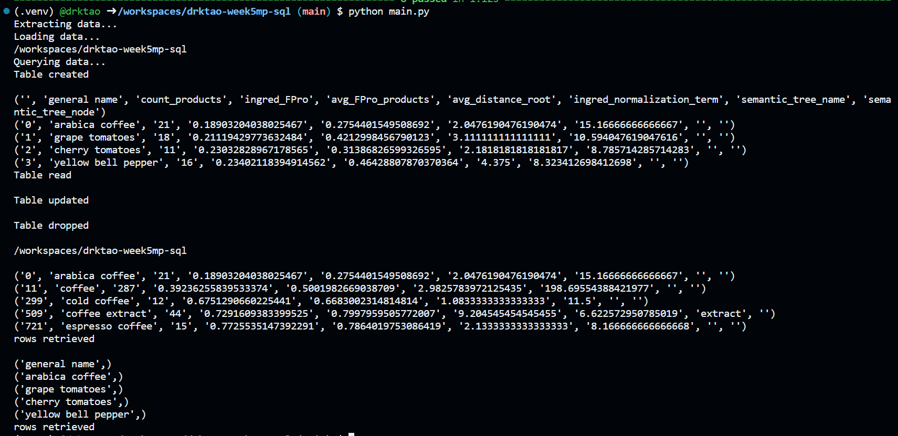
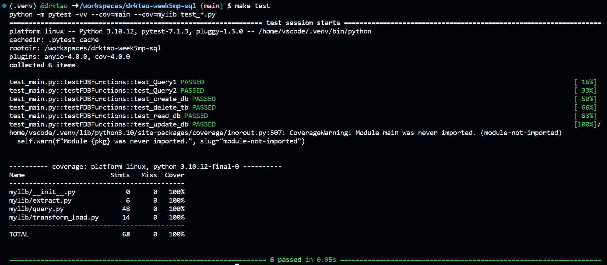

## Individual Project 2
In this project, I performed CRUD operations on an SQLite database using Rust. Specifically, 

        `create_db()` - creates a new table with column names if needed
        `read_db()` - displays rows of the data
        `update_db()` - updates certain fields of the data
        `delete_tb()` - deletes a table from the database
        two additional queries that display rows based on certain conditions

As with many prior projects, the repo also contains the following files:
1. `Makefile` - commands for `make install`, `make format`, `make lint`, and `make test`
2. `requirements.txt` - lists necessary packages for this project
3. `main.py` - executes data extraction, loading, and querying
4. `main_test.py` - runs tests on all database queries

Below is a log of successful CRUD database operations, as well as successful tests.

